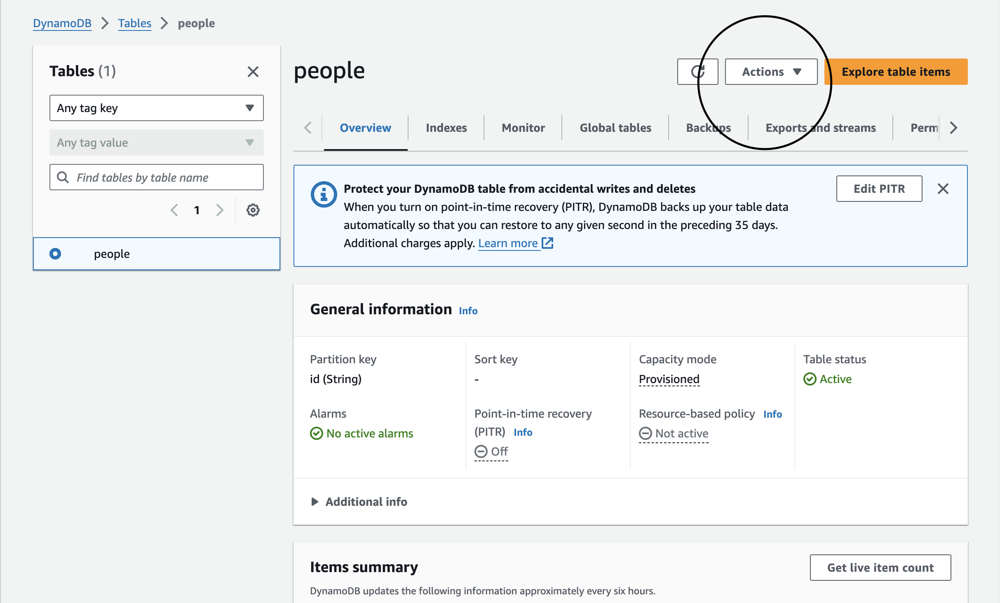

# Dynamo DB

## Notes:

Day will consist of going to DynamoDB which is a NoSQL Database (similar to MongoDB)

- Create a table (name it people)
- partition key will be the primary key (call it id) and keep the rest of the settings.

Once you create table go to API Gateway service
    - Select REST API (the regular one)

Then name the route, and create the gateway. 

You will then want to hit create resource.
    - just give the resource a name; no need to select CORS or configure as proxy resource. 

Hit create method 

Select method type

PAUSE ---- have to go and create a lambda function!

Now go to lambda to create a function

Name function, Choose the Node.js 18 and then create.

When function is created, we have to bring in some **dependencies**. But first change the name of the file from index.mjs to index.js

Then create a handleGetPeople function();
    - npm init -y
    - npm install dynamoose

create the Archive.zip file by compressing node_modules,index.js, package-lock.json, and package.json.

upload the file on lambda, and give it dynamoDB full access role.

Once done,

- create a Schema in the index.js

Add code to lambda. Then create item from the actions tab.

Use scan or query items to look for specific things. 
add an attribute and the the value to look for it in the table.

Go back to API GateWay

select function you want to test out
select proxy integration option. 

Get by Id:

create resource on the GET method