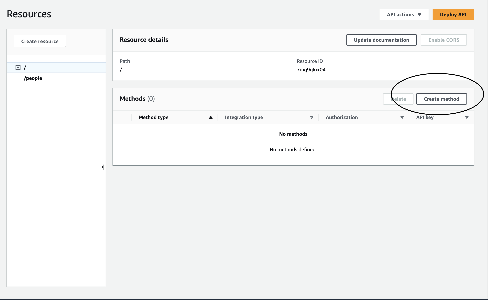

# Dynamo DB

## Notes:

Day will consist of going to DynamoDB which is a NoSQL Database (similar to MongoDB)

- Create a table (name it people)
- partition key will be the primary key (call it id) and keep the rest of the settings.

Once you create table go to API Gateway service
    - Select REST API (the regular one)

Then name the route, and create the gateway. 

You will then want to hit create resource.
    - just give the resource a name; no need to select CORS or configure as proxy resource. 

Hit create method 

Select method type

PAUSE ---- have to go and create a lambda function!

Now go to lambda to create a function

Name function, Choose the Node.js 18 and then create.

When function is created, we have to bring in some **dependencies**. But first change the name of the file from index.mjs to index.js

https://pvbv6y6z5l.execute-api.us-west-2.amazonaws.com/undefined

The routes:

- Post: /*/POST/people
- Get: /GET/people/
- Put: /PUT/people/
- Delete: /*/DELETE/people
