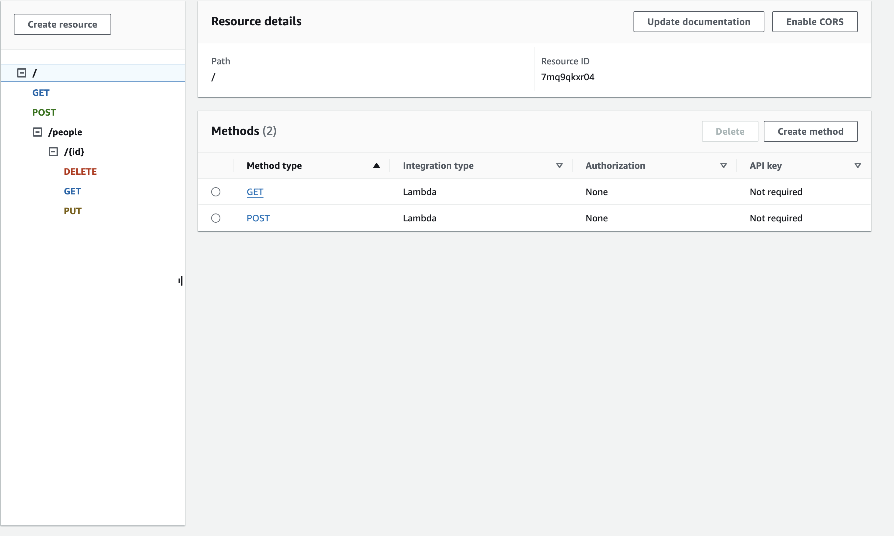

# Serverless API

## Author: Brandon Mizutani  
## Version: 1.0.0  

### Dynamo DB

#### Notes:

This project involves setting up a serverless API using DynamoDB, a NoSQL Database similar to MongoDB.

- Start by creating a table named "people" in DynamoDB with the partition key as the primary key (id), and keep the rest of the settings as default.

Once the table is created, proceed to the API Gateway service.

- Select the REST API (the regular one).

Name the route and create the gateway.

Create a resource without selecting CORS or configuring it as a proxy resource.

Create a method.

Select the method type.

Before proceeding, create a Lambda function.

Name the function, choose Node.js 18, and create it.

Once the function is created, ensure to bring in the necessary dependencies. First, change the name of the file from index.mjs to index.js.

The routes for the API:

- POST: `/*/POST/people`
- GET: `/GET/people/`
- PUT: `/PUT/people/`
- DELETE: `/*/DELETE/people`

The route structure on DynamoDB is as depicted in the following screenshot:

Ensure proper configuration and testing of the API endpoints to ensure smooth functionality.
